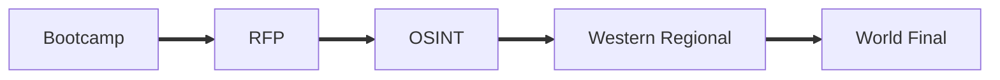

# Introduction
The [Collegiete Penetration Testing Competition (CPTC)](https://cp.tc/) is a cybersecurity competition that, you guessed it, revolves around penetration testing. The main goals of the competition is to provide students an opportunity to experience the real world of professional penetration testing, beyond what is taught in things like the classroom, HackTheBoxes, and CTFs. 

In CPTC, a team of up to 6 students perform a penetration test and security audit on a fictitious organization, then document the findings in a [penetration testing report](https://github.com/nationalcptc/report_examples). Cal Poly Pomona has never won an event in CPTC before.

# Season Overview
Let's set the stage for a moment. The rookie from last year's CPP CPTC roster is the sole remaining team member and de facto captain of the team. In addition to finding 7 of Cal Poly Pomona's top penetration testing hotshots, said rookie now has to train and lead. Welcome to the world of our captain, [Alex](https://nosecurity.blog/).

The above timeline is the overview of our competition season.

Before the season even officialy kicks off, CPP needed to build a team. Alex, our team captain, [put together a multi-week bootcamp](https://nosecurity.blog/cptcGuide) that covered the basics of penetration testing that ultimately led up to a tryout process. The applicants with the highest rubric score were selected and chosen to be apart of the CPTC roster. 

Once the roster was solidified, the seasons starts with the Request for Proposal (RFP). In this case, it was a document that the fictional business published requesting for penetration testing services. This year, the company was "Le Bonbon Croissant" (LBC), a food manufacturing and distribution company. Out of all the RFPs that were submitted by schools, CPP was selected to compete in the Western Regional. 

With teams locked in for the Regional events all over the world, the CPTC organizers begin dropping hints via Open Source Intelligence (OSINT). My team and I originally thought that this year's OSINT portion was very weak. After finding the low hanging fruit — social media accounts, a GitHub repository, and a StackOverflow leak — our team struggled to deduce anything meaningful. The social media accounts had a lot of red herrings that through us off like suggestive passwords ("Steptember1"), and the none of the leaks related to infrastrucure gave us any more insight than an idea of what to expect during the engagement (e.g. Swagger API, OpenCart). Sure, these are still significant findings, however, it is much less than what we were expecting. The overall impression was that we were either missing something huge or this year's organizers really didn't care about OSINT. It turned out to be the former.

After the World Finals debrief, we learned that there was actually more to the StackOverflow post we found. The post we found was edited, meaning there was something we weren't seeing. It turns out that the entirety of the Swagger API was leaked and included nods to other endpoints that we could have used during the competition. Additionally, there was a leaked database of customer data, which would have been a huge finding for our report and presentation.

# Regionals 
## Initial Assessment
When my team and I arrived at our competition room, we had a small briefing to calm our nerves and eat a small breakfast with each other. Personally, it made a big difference. It was my first ever penetration test, and I was suffering severe imposter syndrome. I have to give credit where credit is due and thank Alex for his reassurance during that briefing.

As access to the environment neared, we went back to our seats, setup our workstations, and got ready for the long day ahead of us.

The Regionals environment invited the penetration teams to the warehouse network of LBC. The warehouse had a single, flat network with several Linux systems running various services like databases, websites, APIs, and a several simulated PLCs. 

[Nathan](https://nathaneberhardt.com/), our co-captain, branched a project created by our alum to create a completely new product: [jVision]((https://github.com/neberhardt123/jVision)). It's predecessor, [nVis](https://github.com/Menn1s/nVis), was created by Silas and Dennis during their years on the roster. It was built to centralize nmap scanning and allow for better cooperation and coordination during penetration tests. Nathan's jVision used the concept as a baseline and completely rebuilt it from the ground up and innovated it's front end to provide a better user experience.

We kicked off Regionals with jVision and quickly got a high-level view of the environment. From there, we split up and started tackling boxes on our own to gather any reconnaissance. After a few hours, we began discovering some critical vulnerabilities in boxes like default credentials and weak SSO. A good ways into the competition, an inject suggested that new OSINT information may be discoverable. In a matter of minutes, Nathan identified a public Google Drive folder with recordings of Zoom meetings that leaked confidential information. One of the recordings mentioned that ScadaBR was running on the environment. I quickly located it on the .50 box, used default passwords to eventually get remote code execution via a CVE as root. Over the next several hours, we continued to occasionally find a new vulnerability every now and then, but we were really struggling to find more to report. Of note, [Dylan](https://dtsec.us/) was able to get remote code execution as the user *postgres*, but we weren't able to escalate to root. By the time access to the environment closed, we had only 8 findings.

We quickly eat dinner that was delivered to us (shoutout to our teammates [Taylor](https://tsnguyen.com/) and [Jacob](https://www.jacobjayme.xyz/)) and went directly into report writing. One benefit of having less technical findings is needing to write less on the report. Although it might seem like a bad trade, we ended up tying up our loose ends at the very last minutes of the competition anyways. Even one more finding, and we probably would not have been able to finish our report. I read the report from top to bottom a good number of times, and slowly refined its word choice, voice, and consistency.

The next day, we got word that we earned 1st place and a direct seeding to the World Finals.

## Rabbit Holes
Throughout the assessment, we struggled to successfully gain remote code execution on the majority of the boxes. While we strongly believed that the public facing APIs were vulnerable, we could not prove it with any exploit attempts. 

Another thorn in our side was MPD and NetJukebox. While we tried several attack vectors on both the MPD server and NetJukebox itself, we could not successfully find a way to get remote code execution. Though there was some intentional glitchiness to make it difficult to login, we were able to login to the admin account for NetJukebox. Unfortunately, it led to nothing and we wasted a lot of time exploring.

# World Finals 
## The Reassessment
The reassessment this year was largely similar to the regional environment. There were a handful of key differences, but CPTC organizers admitted that some of those differences were entirely accidental (deployment errors). Below is an image of the environment from LockBoxx, who posts [great insights into the CPTC organizers side of things](http://lockboxx.blogspot.com/2022/01/cptc-2021-finals-review.html).  

One change to the environment that was significant during the first day of competition was the removal of the .50 and .51 boxes. Our jVision scans showed us similar results as the previous round, so we just got to work on hunting for vulnerabilties on the familiar machines. During the first hour we reassessed all the vulnerabilities we previously found. Although a few still worked, most were patched. We did notice some small differences in the repeat vulnerabitilies like more data was inside the databases this time around, but the bottom line was that if the vulnerability was from Regionals, it was exploited in the same exact way. If you couldn't do it the same way, it was patched.

On the second day, we came back with renewed energy and fire. A little while in, the .50 and .51 boxes returned into scope and we quickly identified multiple critical vulnerabilities with ScadaBR that returned from Regionals. Not too long afterwards, [Justin](https://covertops.xyz/) also identified PLC BRIDGE access on .51, which we did not identify before. After several hours of no progress, morale was at an all-time low. We ended up moving on from the pentesting earlier than expected. We learned from Regionals that rabbit holes would only waste our time. For the last our of access on the environment, we shifted focus on preparing our findings for the report.

We prepared a PowerPoint presentation with some very effective slide transititons that I believe would have really impressed the judges, but unfortunately, we had to switch our slideshow to Google Slides. Although Google Slides is a nifty tool, PowerPoint is a significantly better product. With [Robinson](https://rsecke.com/), we completely redesigned our presentation to adapt to the limitations of Google Slides. It would have been nice to use our presentation template, but alas.

## In-Character Interactions
What really separated the World Finals from the regional qualifier was the in-character interactions - specifically the walk-in variety. Although my team and I competed remotely, the CPTC organizers set up a web camera on Zoom so that we could still get the experience. Members of CPTC would come by and act fully in character. We had to answer some questions they had, or sometimes they just let us know of an inject by word-of-mouth instead of by email. It was a fun way to immerse ourselves inside the competition.

# My Takeaways
## Business
The largest takeaway is, unsurprisingly, the theme that the organizers were aiming for: it's a business. To elaborate, that means we had to focus on what the *business* wanted or cared about. Keeping on top of things like the CEO's Twitter for the latest Tweets and answering questions are all things my team and I will do moving forward.

## Technical Skill
Another, major takeaway is technical skill. Since there was a very difficult environment this year, we will need to further develop our technical knowledge depth and breadth to have a more successful season next year. We lucked out that we had some familiarity with the content that was focused of this year, but we the lesser. 

## Rabbit holes
The last major takeaway is cutting away from rabbit holes earlier. My team and I wasted a good chunk of time going down rabbit holes and isolating ourselves into silos. That was time that would've been better spent doing either the report, exploring other vulnerabilities, or even just discussing our research with the team.

# Suggestions for CPTC

It would be disingenuous to say that, just because we won, CPTC was a perfect event. It had it's stregnths, but there were many key areas that I feel could be improved on in following seasons. Despite my qualms, I do beleive CPTC is a great competition. I raise these concerns to hopefully contribute to its growth and longevity. May they serve as points of thoughtful discussion.

## Subnets
I completely understand that the goal of CPTC this year was to focus on the business side of things. However, I don't believe it had to come at the cost of a limited environment. For example, the [significant rubric changes made this year](http://lockboxx.blogspot.com/2021/12/cptc-2021-regional-review.html) could have taken more weight out of technical findings to dilute a larger number of findings. More importantly, only having 1 subnet that did not grow inbetween rounds was dissapointing to say the least. Disregarding that the competition is less fun with a smaller environment, a smaller competition environment limits the ability for the comeptitors to grow and improve upon their technical skills. You could argue that CPTC isn't the place to learn technical skills, but I think that's just a huge oversight of the potential of CPTC. Why force students to choose if they will learn business *or* technical skills? CPTC *can* and *should* teach both.

## More presentation time
I understand that presentations take time to perform and grade, and that it only gets harder as the competition grows more every year. But I think that 10 minutes for both presentation and Q&A is not enough time to accurately differentiate the skill of teams and to give a decent presentation to executives. Personally, I feel I did not have time to give a quality presentation. I would suggest that presentation and Q&A times should be separate: 10 minutes for presentation and 2 minutes for Q&A. If the team ends their presentation early, they forfeit that time and the Q&A portion will start early. If it pushes back awards by a few hours, I don't think any teams would mind, especially if it gave the opportunity to make presentations higher quality.

## Prize money
I'll be frank, prize money is always nice. Even if it is only a few hundred per player, that would be enough to seriously excite some of the competitors and even get new schools to join. For a competition of this caliber, I was honestly surprised to learn that there was no monetary prize. I understand that infrastructure and reimbursements costs a ton of money for CPTC. If those are taking up all the income. Considering the teams can't even choose what prize items they get from categories, even if it's just for the top spot, having a monetary prize should be a thing.

# Closing Thoughts
CPTC was a great experience, and it will always be known that my team and I were victorious in the [Halls of Victory](https://cp.tc/previous-winners). This was my first season competing in CPTC, and penetration testing in general. In fact, it was the first season of CPTC for 7 out of the 8 members in the Cal Poly Pomona CPTC team. Including myself, there were 3 underclassmen on the team. Individual experience was definitely lacking, but we made up for it with fiery passion, terrible sleep schedules, and the support of previous generations. By no means were we the best technical team (e.g. Stanford found the most zero-day exploits), but we had spirit and carried the dreams of those who came before us. We carried on their legacy, as will the next generation carry ours. We stand on the shoulders of giants. We are the 2021-2022 CPTC global champions.  

And we are eagerly waiting to defend our title.

---

My teammates spent a ton of time and effort to win this year. Check out the websites below.
- Alex: [https://nosecurity.blog/](https://nosecurity.blog){:.button.button--primary.button--rounded.button--sm}
- Nathan: [https://nathaneberhardt.com/](https://nathaneberhardt.com/){:.button.button--primary.button--rounded.button--sm}
- Justin: [https://covertops.xyz/](https://covertops.xyz/){:.button.button--primary.button--rounded.button--sm}
- Robinson: [https://rsecke.com/](https://rsecke.com/){:.button.button--primary.button--rounded.button--sm}
- Dylan: [https://dtsec.us/](https://dtsec.us/){:.button.button--primary.button--rounded.button--sm}
- Taylor: [https://tsnguyen.com/](https://tsnguyen.com/){:.button.button--primary.button--rounded.button--sm}
- Jacob: [https://jacobjayme.xyz/](https://www.jacobjayme.xyz/){:.button.button--primary.button--rounded.button--sm}
