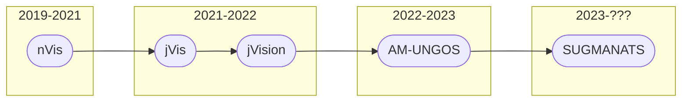

# Introduction

This blog post is dedicated to how and why I made SUGMANATS. If you want to set it up, read the documentation in the repository. SUGMANATS isn't 100% polished in all facets, so please report any edge cases.

<a class="button button--primary button--pill" target="_blank" href="https://github.com/dbaseqp/SUGMANATS">SUGMANATS Repository</a>

SUGMANATS features:
- TOML configuration file
- Operation progress dashboard
- Live filtering
- Dynamic tabs in Box view
- Multiple NMAP file upload via AJAX
- Server-side events to notify updated data
- Data propagation for re-uploaded NMAP data
- Markdown rendering of notes
- Credential storage
- Task board

If you have any ideas of how to make SUGMANATS better, I'm always accepting pull requests! 

# Reinventing the Wheel

## The Wheel
[CPP Cyber](https://cysec.team/) has a long history of NMAP aggregating. Let me present to you: the SUGMANATS family tree!



### nVis
In 2019, nVis was born. It was the first attempt at solve the issue of running NMAP scans on a subnet in CPTC. The issue with scanning a subnet isn't that NMAP doesn't support it, it's that it's very slow. When you run a scan with the usual verbosity tags `-sSVC` on a subnet, it may take several minutes to get results back. The solution nVis implemented was to have several client scripts run and scan different parts of the network, then send the results to a dockerized central MongoDB server to centralize all the information. This essentially allows subnet to be scanned in parallel. For the first 2 years, it was enough.

### jVis and jVision
When I joined the CPTC team in 2021, my former CCDC teammate, [jbrick](https://github.com/neberhardt123), also joined. At this point, the creators of nVis had graduated, so jbrick took it upon himself to pick up the project. Unfortunately, the codebase wasn't too great so he decided to remake it in his preferred languages/frameworks (Python w/Django). Thus, jVis was born. He continued the idea of having client scripts run and callback to a central server. Halfway through the LeBonbon Croissant season, jbrick called it quits with Django and swapped to Blazor (a C# web framework) to create a more matured jVision. 

### AM-UNGOS
When jbrick graduated at the end of the 2021-2022 season, I took up the mantle of NMAP aggregator. While jVision had some nice features, it was ultimately both slow (.NET isn't great), difficult to maintain, and crashed during the previous year's global finals, making it unviable. I decided to also start from scratch, but this time using a super portable language that I had just looked into (Golang). While I was a complete novice, I was able to stich together AM-UNGOS from enough tutorials while totally paying attention in my California history class. I ditched the client NMAP scanners in favor of letting users run their normal NMAP scans (e.g. `nmap -sSVC`) and upload it through the web user interface. There was nearly 0 JS to keep things simple. Deployment was super simple, and using AM-UNGOS was very intuitive without needing to know how it worked.

At the end of globals, we received ***__extensive__*** technical feedback that really went into ***__extreme__*** detail. It was ***__so__*** long that you may have to zoom in. I've attached our entire feedback below.


> The best technical feedback in the history of CPTC ever

### SUGMANATS
When I decided to start working on SUGMANATS, I was asked by my team why didn't I just update AM-UNGOS. The name was iconic, but AM-UNGOS suffered from several problems, as it was my very first Golang project. Some of the main issues were:

- You couldn't log out without manually disabling browser cache
- Quickly not performant as boxes got added
- Really janky, copy-pasted CSS/JS
- Random/not thought out project structure
- New scans overwrote old scan data

The codebase was frankly terrible to work with. Now that I've had a year to work with and learn Golang with Gin, I was much more confident in making an extensible project for myself and for anyone who wants to continue it. With that in mind, SUGMANATS's purpose is mainly just to write a cleaner version of AM-UNGOS, so there aren't any substantial new features.

This time, instead of taking months of development, I finished SUGMANATS in about a week. It uses Gin to serve both an API and a frontend using Golang HTML Templates. In true Bootstrap 5 fashion, I avoided using jQuery and opted for using vanilla JS features such as the Fetch API for AJAX and selectors like `document.getElementById` for getting elements. Also dark theme 😊.

# Design Process
## Project Structure and Configuration

Below, I explain the project structure of SUGMANATS. I'm only highlighting the main parts.
```
SUGMANATS/
├─ assets/
│  ├─ custom.js   <-- custom JS functions
│  ├─ ...
├─ models/
│  ├─ config.go   <-- toml configuration struct + handling
│  ├─ nmaprun.go  <-- struct for XML NMAP output
│  ├─ schema.go   <-- structs for sqlite3 schema
│  ├─ utils.go    <-- generic utility functions
├─ templates/
│  ├─ ...
├─ db.go          <-- database functions
├─ login.go       <-- login/session functions
├─ routes.go      <-- routes
├─ main.go        <-- main router setup/SSE setup
├─ config.conf    <-- user defined configuration file
```

The router generated in `main.go` uses the routes defined in `routes.go`. There are 2 main route groups, `public` and `private`. In `routes.go`, the route is defined with the endpoint and the handling function. The handling function should return either HTML (if the endpoint is part of the UI) or JSON (if it is solely part of the API).

```go
func addPrivateRoutes(g *gin.RouterGroup) {
	g.GET("/dashboard", viewDashboard)
}

...

func viewDashboard (c *gin.Context) {
	boxes, err := dbGetBoxes()
	if err != nil {
		c.HTML(http.StatusInternalServerError, "dashboard.html", pageData(c, "Export Boxes", gin.H{"error": err}))
		return
	}

	pwnCount 	:= 0
	usershells 	:= 0
	rootshells 	:= 0
	for _, box := range boxes {
		if box.Usershells > 0 || box.Rootshells > 0 {
			pwnCount++
			usershells += box.Usershells
			rootshells += box.Rootshells
		}
	}
	c.HTML(http.StatusOK, "dashboard.html", pageData(c, "Dashboard", gin.H{"boxes": boxes, "pwnCount": pwnCount, "percent": (100*float32(pwnCount)/float32(len(boxes))), "usershells": usershells, "rootshells": rootshells}))
}
```
> Example route flow: routes.go

Inside the handler, you write fairly straightforward code that receives or gets data that needs to be hydrated into the page. In an attempt to implement [dependency injection](https://www.youtube.com/watch?v=J1f5b4vcxCQ), my handler functions abstract away most of the code behind database functions defined in `db.go`.  

```go
func dbGetBoxes () ([]models.Box, error) {
	var boxes []models.Box
	
	subquery := db.Table("boxes").Select("id,MAX(timestamp)").Group("ip")
	result := db.Table("boxes").Joins("INNER JOIN (?) as grouped on boxes.id = grouped.id", subquery).Find(&boxes)

	if result.Error != nil {
		return nil, result.Error
	}

	return boxes, nil
}
```
> Examples routes flow: db.go

SUGMANATS uses [GORM](https://gorm.io/) to interact with the sqlite3 database. I had a lot of challenges understanding how to translate raw SQL into GORM statements (yes, I know `Raw` exists), but I think in the end it ended up working out. I'm not sure if there are better tutorials out there, but I just used the docs. The main things I needed to know: `AutoMigrate` builds the database based on given Golang structs, functions that accept structs (i.e. `Model`) will automatically try to match rows with the struct's values (e.g. ID, Name, IP), and `Preload` can be used to get associated rows when the database is in second normal form (2NF). `Preload` in particular is useful if you have something like a `User` struct that can have many `Role`s. Your `User` struct can have an array of `Role`s (maybe named `[]Roles`), and when you call `Preload` while getting `User`s, `[]Roles` will be populated with the rows that were associated with the user. No secondary select required!

---

In my opinion, TOML is the best configuration file markup language. It is very intuitive to read and write. I've been using TOML in a few Golang projects now, so I've made a very portable config file setup in `SUGMANATS/models/config.go`. 

A configuration file is ***REQUIRED*** because that is where users are defined. I chose to do this instead of registering new accounts because operators should be pretty static. If you need to add a new user, you can just add a new user and re-run the binary.

```toml
# Example configuration file

operation = "RAKMS"
# dbpath = "temp.db"      # rename database file

[[admin]]
name = "baseq"
pw = "password"
...
```

## Dashboard

The SUGMANATS dashboard is a simple way to gauge progress on the network. 

I considered adding more information here, but I couldn't identify any other metrics that would be useful here. Open to suggestions.


> SUGMANATS dashboard. There is a special surprise if you get a shell on every box. 

## Boxes
The Boxes view is where the real magic happens. The button on the left side opens up the menu which shows the filter menu, upload menu, and Box list. When you open a Box from the Box list, it'll create a tab in the center pane. This allows users to focus more on the boxes they are currently working on. Tabs can be closed as necessary, but currently don't support rearrangement. The state is saved in the URL, which means they can be reloaded or even shared. The right-most tab is the one that will be opened by default. The notes of each box are have Markdown rendering, but it's rendered as part of the initial HTML response, so changes to notes require a refresh to view. 


> SUGMANATS boxes

## Export Boxes
The Export Boxes view is a static view of the page. It's main use is to have a view where all content is visible.


> SUGMANATS boxes

## Credentials
The Credentials view allows users to store known username/password combinations with an associated note. 


> SUGMANATS export boxes

## Tasks
The Tasks view allows users to create and assign tasks. Notes support Markdown. 


> SUGMANATS tasks

## Misc
The last few pages are very simple


> SUGMANATS misc. pages

`Settings` allows users to pick their color.

`About` just shows a dump of the configuration file.